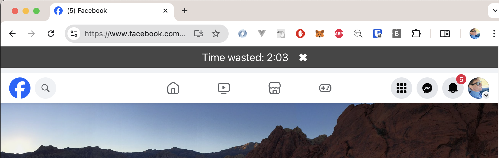
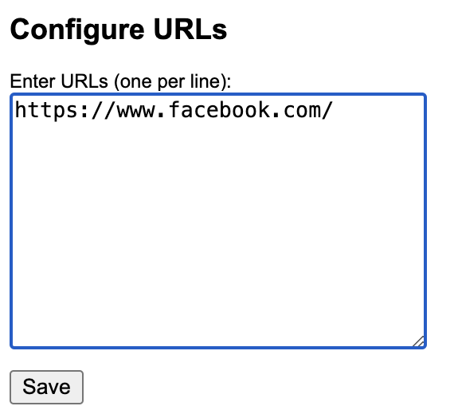

# Banner Timer
Chrome extension that shows how much time you are wasting on a website.

## Installation
1. Clone this repository to your computer
2. Load the extension in Chrome:
- Open Chrome and go to chrome://extensions/.
-	Enable “Developer mode” (toggle it on).
- Click on “Load unpacked” and select the project folder.
- Click on "Extension options" and add URLs one per line, make sure to include "http(s)://"

